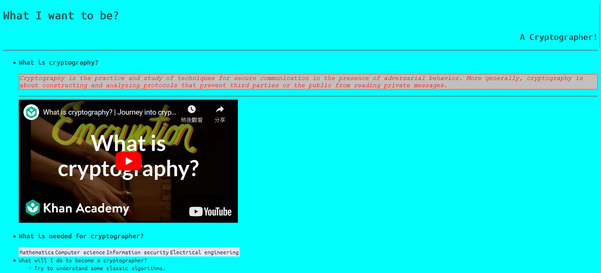

# 2023-2024 CL _My_Dream_Career

2023-2024 Computer Literacy Homework "My Dream Career" website

Requirement:

```

Write an simple webpage on the topic "My Dream Career". You must use the all of the following html features: title, header, hyperlink, images, text formatting such as bold and italic, color, list and table.

Your webpage should include a heading, an introduction, and contents. You should mention what is your dream career, why you want to pursue such a career, and how do you plan on fulfilling your dream.  You are encouraged to user multimedia contents such as images and video. 

Please hand in your html file(s) and all file necessary to view your webpage. If your submission include more than one file, zip all of your files and folders and submit the zip file.

```

This is the screenshot of File"./index.html" on Mozilla FireFox 119.0.1(64-bit) on Microsoft Windows 11 Home 22H2(Trad. Chinese)


The File"./checksums-signed.txt" will be signed by PGP. 

The PGP Public Key can get from [GitHub Public Key Server](https://github.com/wts220828.gpg) or [OpenPGP Key Server](https://keys.openpgp.org/search?q=s220828%40wtsmc.edu.hk). 

# License

+ Embed AES HTML5 Animation [Copyright © Forma Estudio 2021 (only used for educational purpose in this practice)](https://formaestudio.com/portfolio/aes-animation/)

+ Embed Youtube Video [Copyright © 2012 Khan Academy(youtube_channel@khanacademy) (only used for educational purpose in this practice)](https://www.youtube.com/watch?v=Kf9KjCKmDcU)

+ File "./d37988688308babbce499d670cfd6e4db6fb9b6d684254d8ec2ffd10b3767721.png" **CC-BY-4.0** Copyright © 2014-2023 *Free Software Foundation, Inc.* [Original File(from FSF)](https://emailselfdefense.fsf.org/static/img/en/full-infographic.png)

+ Font "Ubuntu Mono" **Ubuntu font licence** [Font Specimen Page (Google Font)](https://fonts.google.com/specimen/Ubuntu+Mono)

+ Font "Linefont" **SIL Open Font License** [Linefont Font Specimen Page (Google Font)](https://fonts.google.com/specimen/Linefont)

+ Part of the contect in File "./index.html" is from WikiPedia **CC-BY-SA 4.0**
```

https://en.wikipedia.org/wiki/Cryptographer/

https://en.wikipedia.org/wiki/Cryptography/

```

---

END OF README
